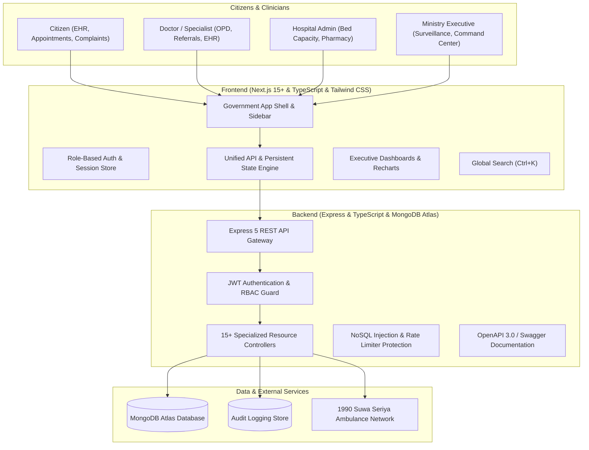

# Ministry of Health Digital Health Platform
### Democratic Socialist Republic of Sri Lanka — Centralized Health Coordination System

A production-quality, government-standard digital healthcare coordination and surveillance platform built for the Ministry of Health. The platform centrally coordinates healthcare facilities, medical practitioners, inpatient bed capacities, emergency trauma responses, disease outbreaks, pharmaceutical supply chains, and citizen health services across Sri Lanka.

---

## 1. System Architecture



---

## 2. Core Functional Modules

| Module | Route | Capabilities |
| :--- | :--- | :--- |
| **Landing Portal** | `/` | Live health counters, public health advisories, primary healthcare services, emergency hotline dispatch. |
| **Executive Dashboard** | `/dashboard` | Executive KPIs, interactive national health map, hospital bed capacity chart, disease curves, system health status. |
| **Hospital Management** | `/hospitals`, `/hospitals/[id]` | Real-time facility directory, bed capacity meters (ICU/General), departments, doctor roster, on-site edit modal. |
| **Medical Staff** | `/staff` | SLMC-accredited practitioners, weekly outpatient clinic hours, appointment slot allocation. |
| **Patient EHR Registry** | `/patients`, `/patients/[id]` | Personal Health Number (PHN) issuance, allergy warnings, chronic illness profiles, clinical visit timelines. |
| **Appointment Scheduling**| `/appointments` | Multi-step booking wizard, confirmation status pipeline, doctor clinical completion notes. |
| **Inter-Hospital Referrals**| `/referrals` | Cross-facility transfer workflow (*Created → Review → Decision → Transfer Arranged → Completed*), printable official slips. |
| **Medicine Inventory** | `/medicines` | Medical Supplies Division (MSD) inventory tracking, shortage alert banners (`CRITICAL`, `OUT_OF_STOCK`), stock adjustments. |
| **Vaccinations & EPI** | `/vaccinations` | Childhood EPI coverage (97.5%+), school HPV targets, digital certificate lookup with QR verification. |
| **Disease Surveillance** | `/surveillance` | Epidemic curve trajectories, threshold limit breach warnings, pathogen categorization (*Demo / Sample Data*). |
| **Emergency Command** | `/emergency` | High-urgency command center, 1990 Suwa Seriya dispatch tracking, Level 1 & 2 trauma surge status. |
| **Health Campaigns** | `/campaigns` | National health promotion drives, target population progress gauges, behavioral guidance messages. |
| **Grievances & Complaints**| `/complaints` | Citizen grievance filing, 6-stage redressal timeline, administrative department resolution notes. |
| **Official Announcements**| `/announcements` | Government gazette notices, public advisories, downloadable official communique format. |
| **Reports & Analytics** | `/reports` | Statutory reporting engine with period filters (`Today`, `7D`, `30D`, `3M`, `6M`, `1Y`), CSV export, print-ready PDF. |
| **Global Search** | `Ctrl + K` / `Cmd + K` | High-speed command palette searching across hospitals, doctors, patients, medicines, and circulars. |

---

## 3. Technology Stack

- **Frontend**: Next.js 15+ (App Router), React 19, TypeScript, Tailwind CSS, Lucide React, Recharts.
- **Backend**: Node.js, Express.js 5, TypeScript, Mongoose, JWT (access + refresh tokens), Helmet, express-rate-limit, express-mongo-sanitize, Morgan, Winston.
- **Database**: MongoDB / MongoDB Atlas.
- **Testing**: Jest, Supertest, React Testing Library.
- **API Documentation**: Swagger UI / OpenAPI 3.0 at `/api/docs`.

---

## 4. Pre-Configured Demo Accounts

For rapid evaluation of role-based views and permissions, 1-click login buttons are provided directly on the `/login` portal, or you can log in with:

| Role | Email | Password | Access Scope |
| :--- | :--- | :--- | :--- |
| **Super Admin** | `superadmin@example.com` | `SuperAdmin@123` | Complete root system access, user administration, system logs |
| **Ministry Admin** | `admin@example.com` | `MinistryAdmin@123` | National health surveillance, hospital oversight, gazette publishing |
| **Hospital Admin** | `hospital@example.com` | `HospitalAdmin@123` | Hospital bed telemetry, pharmacy inventory, doctor management |
| **Doctor / Specialist** | `doctor@example.com` | `Doctor@123` | Inpatient encounters, inter-hospital referrals, outpatient clinic |
| **Citizen** | `citizen@example.com` | `Citizen@123` | Outpatient booking, personal EHR review, service grievances |

> [!NOTE]
> Demo accounts can also be instantly switched in real-time from the user profile dropdown in the top-right navigation bar.

---

## 5. Local Setup & Running Instructions

### Prerequisites
- Node.js 18.x or higher
- npm 9.x or higher
- MongoDB Atlas cluster or local MongoDB instance

### Step 1: Configure Environment Variables
Copy `.env.example` templates to configure backend and frontend:

**Backend (`backend/.env`):**
```env
PORT=5000
NODE_ENV=development
MONGODB_URI=mongodb://localhost:27017/ministry-health
JWT_SECRET=your-secure-jwt-secret-min-32-chars
JWT_REFRESH_SECRET=your-secure-jwt-refresh-secret-min-32-chars
FRONTEND_URL=http://localhost:3000
```

**Frontend (`frontend/.env.local`):**
```env
NEXT_PUBLIC_API_URL=http://localhost:5000/api
```

> [!CAUTION]
> Never commit `.env` or `.env.local` files to Git. Production secrets must be configured directly in your hosting platform dashboard (e.g., Render & Vercel).

### Step 2: Backend Build & Run
```bash
cd backend
npm install
npm test
npm run build
npm start
```
- API Base: `http://localhost:5000` (or `https://api.yourdomain.lk`)
- Root Health Check: `http://localhost:5000/health`
- Database Health Check: `http://localhost:5000/api/health`
- Swagger OpenAPI Docs: `http://localhost:5000/api/docs`

### Step 3: Frontend Build & Run
```bash
cd frontend
npm install
npm run build
npm start
```
- Web Application: `http://localhost:3000` (or `https://yourdomain.lk`)

---

## 6. Testing & Quality Assurance

### Automated Test Suite (Jest + Supertest)
```bash
cd backend
npm test
```
The test suite validates:
1. System root health check (`GET /health`) returning `{ status: "ok", service: "LankaCare API" }` without exposing infrastructure details.
2. Safe database connection health (`GET /api/health`).
3. Strict Role-Based Access Control (RBAC) matrix across Citizen, Doctor, Hospital Admin, District Officer, Provincial Officer, and System Administrator.
4. Emergency Break-Glass override workflows.
5. Input validation and sanitized error responses.

---

## 7. Production Deployment & Custom Domains

For the full production deployment runbook on **Render** (Express API), **Vercel** (Next.js Frontend), **MongoDB Atlas**, and custom `.lk` / `.com` domain setup, please refer to the detailed guide:

👉 **[`DEPLOYMENT.md`](file:///c:/Users/User/OneDrive/Desktop/Digital%20Health%20Coordination/DEPLOYMENT.md)**

### Architecture Overview:
- **Frontend**: Vercel (`https://yourdomain.lk`)
- **API Gateway**: Render (`https://api.yourdomain.lk`)
- **Database**: MongoDB Atlas Dedicated/Shared Cluster
- **CORS**: Environment-configured origin list without wildcard `*`
- **Security**: Helmet headers, NoSQL query sanitization, 15-min JWT expiry, bcrypt salt 12

---

## 8. Data Provenance & Real Data Policy

LankaCare implements an explicit **Data Provenance & Trust Classification**:
- 🟢 **OFFICIAL**: Data directly synchronized from Ministry of Health Sri Lanka bulletins and LK official registries.
- 🔵 **VERIFIED**: Validated by certified Medical Superintendents or RDHS/PDHS health directors.
- 🟡 **HISTORICAL**: Historical health bulletin records from previous reporting periods.
- 🟣 **CALCULATED**: Dynamically calculated metrics (bed occupancy rates, Data Quality Score).
- 🟠 **USER_SUBMITTED**: Grievances and community dengue reports pending PHI field verification.
- ⚪ **UNKNOWN**: Data not currently available from an authoritative source.

*Notice: LankaCare does not claim all hospital inventory or clinical data is live unless connected to authorized hospital electronic management APIs.*
Protected under the Personal Data Protection Act No. 9 of 2022.

